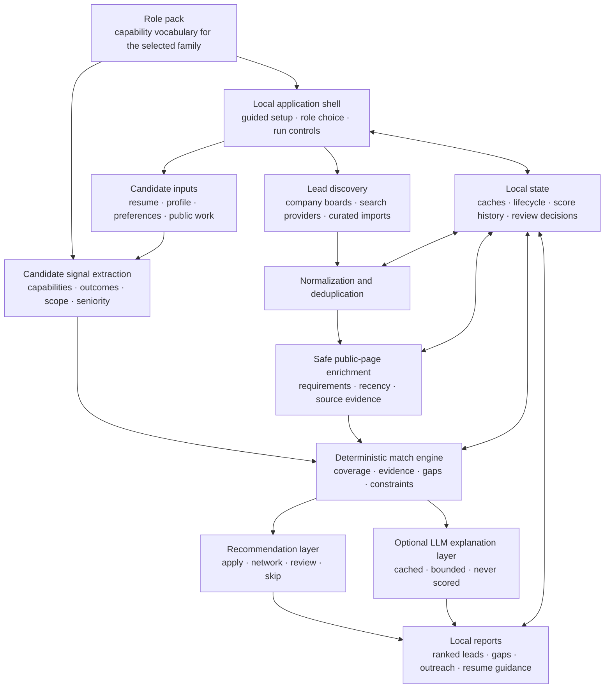

# Catchr: Public Architecture Overview

**Project status:** Catchr is a private, proprietary project created by Arathi Seshan. This document describes its architecture and engineering decisions at a portfolio level. The source code, scoring rules, capability-extraction logic, configuration data, and candidate data are not public.

Catchr is a signal-driven career strategy system for **non-technical roles**. It discovers job opportunities, evaluates them against a candidate's documented professional evidence, and produces evidence-backed guidance for prioritization, outreach, and resume tailoring.

Catchr is an adaptation of Pitchr, a sibling system built for technical roles. It reuses the same deterministic evaluation architecture and replaces technical-skill concepts with **role capabilities and outcome evidence**. The design followed four principles:

- Keep sensitive candidate information local.
- Separate deterministic decisions from generative-AI explanations.
- Make every recommendation traceable to evidence.
- Keep repeated searches and analyses reproducible and cost-aware.

## What the system does

Catchr combines candidate evidence from a resume, professional profile, configured preferences, and selected public work. It normalizes job leads from several discovery sources, enriches leads from safe public postings, evaluates each role through an explainable match pipeline, and generates a set of local reports.

The reports support:

- Opportunity ranking and triage
- Required-capability coverage and gap analysis
- Direct versus transferable evidence
- Recruiter-facing defensibility review
- Resume-tailoring guidance
- Outreach preparation
- Application lifecycle tracking
- Company research

It currently supports six non-technical role families — Product Management, Customer Success, Marketing, Sales & Business Development, Operations, and Program & Project Management — selected through a profile switch.

## High-level architecture

## The Pitchr relationship: one engine, many role families

Catchr's most important architectural property is that it is **not a rewrite of Pitchr — it is the same evaluation engine, specialized through configuration**. Search, ingestion, lead lifecycle, ranking stages, recommendation flow, reports, and test coverage are shared. What changes for a non-technical domain is *data*, not code:

- **Role packs are discovered at runtime.** Each supported family (Product Management, Operations, and so on) is a small set of Markdown configuration — capability vocabulary, alias maps, and bridge relationships. Adding another non-technical family is a configuration change, not a second application.
- **The scored unit is a capability, not a technology.** Where the technical system reasons about tools and stacks, Catchr reasons about demonstrated capabilities and the outcomes that evidence them.
- **Shared vocabulary is composed, not copied.** Reusable capability groups live in one catalog that any pack can compose, so a concept common to several families is defined once.
- **A pack is a contract, not a suggestion.** Every production family must supply capability aliases, outcome aliases, and requirement noise. An automated contract test refuses to ship a pack with an incomplete extraction policy, because a half-configured family would silently produce confident, wrong gaps rather than an obvious failure.
- **Families are separated before scoring, not by it.** Each pack declares distinctive title markers that let the shared ranking gate reject an adjacent family up front, with the active family taking precedence so a legitimate cross-functional title is not discarded.

This is the design claim the project is meant to demonstrate: a deterministic matching engine whose domain knowledge lives in data can be re-pointed at a very different job market without forking its logic. The corollary is that the configuration then needs the same rigor the code has — hence the contract test.

## Architectural boundaries

### 1. Discovery is separate from evaluation

Search providers answer "what opportunities exist?" The match engine answers "how well does this opportunity align with the candidate's evidence?" Keeping these responsibilities separate prevents source-specific behavior from silently changing scoring.

Every lead is normalized into a shared representation before evaluation. The normalization stage handles duplicate links, reposted roles, source metadata, dates, and lifecycle state.

Discovery is provider-agnostic by design. Any one of several supported search providers is sufficient, the provider may be chosen explicitly or left automatic, and the run log names the provider that was actually used without ever displaying the credential. When company boards and web search are requested together, an empty or below-threshold search is treated as a non-fatal outcome: the stale search snapshot is cleared and the run continues with the configured boards rather than failing.

Postings from recruiters that withhold the employer are labelled as employer-undisclosed and excluded from employer-specific research until the hiring company is actually identified, so the system never researches a company it merely guessed.

### 2. Candidate evidence is extracted independently

Catchr builds a candidate signal model from configured source documents. Signals include demonstrated capabilities, outcome and impact evidence, role scope, seniority, leadership evidence, and target constraints.

The system distinguishes among:

- **Direct evidence:** a capability explicitly supported by the candidate's documents
- **Transferable evidence:** adjacent experience that can credibly bridge a requirement
- **Missing evidence:** a requirement that is neither direct nor safely transferable
- **Context:** information worth reviewing that should not inflate the score

This distinction is preserved in the reports so a high-level percentage never hides how the match was derived.

### 3. The match engine is deterministic

The core ranking path is deterministic and testable. It combines multiple evidence dimensions rather than relying on one keyword-overlap number. Those dimensions include role and level alignment, candidate evidence, requirement coverage, capability relevance, source confidence, recency, gaps, and deal-breakers.

The exact weights, capability maps, thresholds, and extraction policies are proprietary. At the architecture level, the important property is that identical normalized inputs produce identical ranking outputs.

### 4. Generative AI is an optional assistance layer

The optional AI layer explains already-computed results and supports bounded drafting tasks such as outreach and résumé guidance. It does not assign or modify match scores, lifecycle state, or pipeline decisions.

This boundary provides several benefits:

- Core evaluation and standard reports can run without generative-model calls.
- Model failures fall back to deterministic output and do not alter ranking results.
- Generated prose can be reviewed independently from its underlying evidence.
- Model selection can change without changing the scoring contract.
- Unchanged generated results can be reused from cache without another model call.

## The application layer

Catchr's interface is an additional surface over the existing pipeline, not a replacement for it. Profile parsing, lead ingestion, capability matching, ranking, lifecycle, and report generation stay where they were; the command-line path remains fully supported and continues to own document parsing, scoring, and report generation.

The shell provides guided profile setup, profile readiness, latest matches, discovery and refresh controls, and links to the complete reports. Its guided form reads its question wording from configuration rather than hard-coded copy, prefills existing answers, and writes back into the same profile fields the pipeline already reads.

Each installation represents one person. A neutral first run asks which role family applies before match controls unlock, and a later change is confirmed rather than silent: the current role's answers and document connections are saved, a previously used role restores its own values, and a never-used role starts blank. The applicant-tracking target-company list stays shared across roles, because a candidate's company interests do not change when their role framing does.

Document handling is deliberately narrow. Uploads are size- and type-checked and stored with private permissions, and the interface returns only safe filenames and availability status rather than exposing private document paths. Every mutation is restricted to local request origins and requires a per-process token; pipeline modes are allow-listed; and commands are passed as argument arrays rather than shell strings.

Suggestions derived from a résumé or professional profile fill only blank capability and evidence fields, stay visibly labelled as suggestions, and are never persisted until the candidate reviews and saves. Location, target companies, and exclusions are never inferred from document text at all — those are stated preferences, not extractable facts.

## A deployment seam that stays local

The shell depends on four small contracts rather than reaching into candidate files or starting processes directly: one that resolves every packaged and user-specific location beneath a single workspace root, one that provides profile state and generated artifacts, one that submits pipeline work and reports its status, and one that decides whether a request origin and credential are allowed.

The current implementations are the obvious local ones — a filesystem workspace, a background local process, and localhost-plus-token authorization. The point of the seam is not that anything else is running today; it is that the matching engine never had to learn about deployment. A different delivery model would implement four interfaces rather than fork a scorer, and the local defaults stay the only path candidate documents actually travel.

## Packaging and distribution

The signed macOS package is treated as read-only program material. At launch it installs program assets into the user's standard local data directory, seeds a profile and working files only when they are absent, and then runs the original pipeline against that workspace. Later launches refresh program assets while the profile, private documents, leads, caches, and generated reports remain user-owned and are never replaced. Data directories are restricted to the current operating-system user, and candidate-owned files use owner-only read and write permissions.

The packaged executable invokes the existing engine internally, so installation does not require a separate system Python and — more importantly — does not introduce a second scoring path that could drift from the one under test.

Distribution is staged rather than opened. A notarized release workflow exists, and testing began with a small private ring covering each supported family, shipped with fictional résumés so a tester can evaluate match quality before deciding whether to use personal documents. Beta kits carry no repository data, no real candidate profile, and no provider credentials.

## Agent and model optimization decisions

Catchr includes several mechanisms intended to control model cost, latency, and failure impact:

- **Task isolation:** model-generated explanations are isolated from ranking and lifecycle logic.
- **Configurable model selection:** the explanation task can use a lower-cost model when appropriate.
- **Stable prompt-prefix caching:** reusable system and candidate context is structured as a stable cached prefix.
- **Persistent result caching:** results are keyed to posting content and model choice, allowing unchanged work to be reused across later runs.
- **Bounded input:** long job descriptions are capped before model submission to avoid sending irrelevant legal and benefits boilerplate.
- **Call ceilings:** a run can limit how many new model calls are allowed.
- **Strategy scoping:** generation can be restricted to selected recommendation groups rather than every discovered lead.
- **Dry-run cost projection:** the system can estimate eligible calls, token volume, and model cost without invoking an API.
- **Graceful fallback:** errors return the workflow to deterministic output instead of failing the overall pipeline.

These controls make the model a replaceable component rather than an unbounded dependency.

## Evidence provenance and explainability

A job requirement may come from an explicitly curated lead, a public posting section, or another supported source. Candidate evidence may come from the resume, professional profile, public work, or a configured transferable-capability relationship.

Catchr carries this provenance into its review surfaces. A user can see whether a match is direct, adjacent, preferred rather than required, or still unsupported. Gap displays include the posting evidence that caused the term to be treated as a requirement.

This approach is designed to reduce two common failure modes:

1. Crediting experience the candidate does not actually have.
2. Penalizing the candidate for prose, navigation text, benefits language, or optional qualifications incorrectly treated as requirements.

## Reliability and reproducibility

Catchr treats ranking changes as changes that should be observable, not hidden.

Reliability mechanisms include:

- Persistent public-page caches with controlled refresh behavior
- Idempotent normalization and deduplication
- Durable lifecycle state for applied, rejected, closed, and preserved leads
- Score-history snapshots and score-delta reports
- Versioned extraction behavior for detecting stale derived data
- Safe fallbacks for unavailable network and model services
- Structural validation of generated Markdown and HTML reports
- A role-pack contract test that blocks a family whose extraction policy is incomplete
- A disposable application-flow check after successful runs, covering first-time setup, document-derived suggestions, profile saving, reopening, and role switching; it never alters saved data or a successful pipeline result
- More than 500 automated tests across five suites, covering parsing, matching, evidence handling, caching, rendering, lifecycle behavior, application workflows, and failure cases

The system favors precision over aggressive inference. Unknown terms are surfaced for review instead of automatically becoming scored requirements.

## Privacy and security model

Catchr is local-first. Sensitive inputs, generated reports, caches, API credentials, and application state are excluded from the public repository surface.

Additional safeguards include:

- Privacy-mode rendering that redacts local paths and candidate identifiers
- Separation of private inputs, user-maintained workspace state, and generated artifacts
- Restricted enrichment of public job pages
- Loopback-only binding for the local application, with allow-listed pipeline modes and a per-process token on every mutation
- Private per-user state stored with owner-only directory and file permissions
- Private document paths withheld from the interface, which sees only safe filenames and availability
- Employer-undisclosed postings kept out of employer-specific research until the employer is known
- No requirement to upload resume or profile data to a hosted service
- Explicit opt-in for paid model generation

## Engineering trade-offs

### Deterministic ranking versus model-based ranking

Using a deterministic match engine requires maintaining capability vocabularies, evidence rules, and extraction policies. It is less flexible than asking a model for a single fit score, but it provides reproducibility, inspectability, offline operation, and clearer regression testing.

### Precision versus recall

Catchr intentionally avoids promoting every unfamiliar phrase into a capability. This can miss emerging terminology until it is reviewed, but it substantially reduces false gaps and inflated scores caused by arbitrary prose.

### Configuration-driven specialization versus a purpose-built app

Serving many role families from one engine keeps behavior consistent and testable, and lets a new family be added through configuration. The trade-off is that each family depends on well-maintained capability vocabularies rather than bespoke logic tuned to a single market.

### A deployment seam versus a deployment

Building the shell against storage, execution, and authorization contracts costs indirection in a product that runs on one machine. It buys the ability to answer "what would it take to deliver this differently?" with an interface list rather than a rewrite, while the shipping product stays local by default.

### One person per workspace versus multi-tenancy

An installation holds one candidate with role-specific profile snapshots. That keeps storage, permissions, and lifecycle reasoning simple, and it means no tenant-isolation bug can expose one candidate's documents to another. The cost is that shared or coached use is not a first-class scenario.

### Local-first versus hosted collaboration

Local operation protects candidate data and keeps the workflow inexpensive. The trade-off is that synchronization and multi-user collaboration are not first-class capabilities.

## What I learned

Building Catchr on top of Pitchr's engine reinforced several engineering lessons:

- A well-bounded deterministic engine can be re-targeted to a new domain through data when its domain knowledge is kept out of the code path.
- Configuration that drives scoring needs contract tests, because a half-configured domain fails quietly and confidently.
- AI-generated explanations are safer when they cannot mutate the decision path.
- Provenance is as important as the final recommendation.
- Caching needs semantic invalidation rules, not just timestamps.
- Required, preferred, transferable, contextual, and missing evidence must remain distinct throughout the pipeline.
- Packaging is a correctness concern: a bundled copy of the engine is a second scoring path unless it is literally the same one.
- Cost and reliability controls should be designed before a model feature is enabled by default.

## Project status and ownership

Catchr is an actively developed private project by **Arathi Seshan**. This page is a portfolio architecture overview, not source-code documentation or an open-source release.

- GitHub: [arathivanchi-max](https://github.com/arathivanchi-max)
- LinkedIn: [Arathi Seshan](https://www.linkedin.com/in/arathi3)

Copyright © 2026 Arathi Seshan. All rights reserved. No license to the private implementation, scoring system, extraction policies, or proprietary documentation is granted by this overview.
