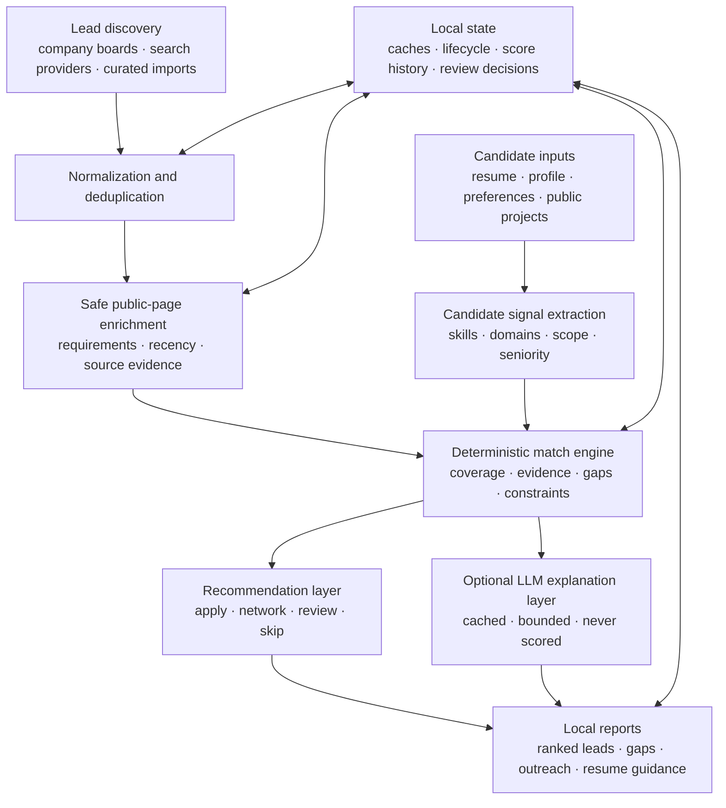

# Pitchr: Public Architecture Overview

**Project status:** Pitchr is a private, proprietary project created by Arathi Seshan. This document describes its architecture and engineering decisions at a portfolio level. The source code, scoring rules, extraction logic, configuration data, and candidate data are not public.

Pitchr is a signal-driven career strategy system that discovers job opportunities, evaluates them against a candidate's documented experience, and produces evidence-backed guidance for prioritization, outreach, and resume tailoring.

The project began as a personal workflow tool and evolved into a multi-stage local application designed around four principles:

- Keep sensitive candidate information local.
- Separate deterministic decisions from generative-AI explanations.
- Make every recommendation traceable to evidence.
- Keep repeated searches and analyses reproducible and cost-aware.

## What the system does

Pitchr combines candidate evidence from a resume, professional profile, configured preferences, and selected public project information. It normalizes job leads from several discovery sources, enriches leads from safe public postings, evaluates each role through an explainable match pipeline, and generates a set of local reports.

The reports support:

- Opportunity ranking and triage
- Required-skill coverage and gap analysis
- Direct versus transferable evidence
- Recruiter-facing defensibility review
- Resume-tailoring guidance
- Outreach preparation
- Application lifecycle tracking
- Company research

## High-level architecture

## Architectural boundaries

### 1. Discovery is separate from evaluation

Search providers answer “what opportunities exist?” The match engine answers “how well does this opportunity align with the candidate's evidence?” Keeping these responsibilities separate prevents source-specific behavior from silently changing scoring.

Every lead is normalized into a shared representation before evaluation. The normalization stage handles duplicate links, reposted roles, source metadata, dates, and lifecycle state.

### 2. Candidate evidence is extracted independently

Pitchr builds a candidate signal model from configured source documents. Signals include technical skills, platform and domain experience, role scope, seniority, leadership evidence, and target constraints.

The system distinguishes among:

- **Direct evidence:** explicitly supported by the candidate's documents
- **Transferable evidence:** adjacent experience that can credibly bridge a requirement
- **Missing evidence:** a requirement that is neither direct nor safely transferable
- **Context:** information worth reviewing that should not inflate the score

This distinction is preserved in the reports so a high-level percentage never hides how the match was derived.

### 3. The match engine is deterministic

The core ranking path is deterministic and testable. It combines multiple evidence dimensions rather than relying on one keyword-overlap number. Those dimensions include role and level alignment, candidate evidence, requirement coverage, domain relevance, source confidence, recency, gaps, and deal-breakers.

The exact weights, term maps, thresholds, and extraction policies are proprietary. At the architecture level, the important property is that identical normalized inputs produce identical ranking outputs.

### 4. Generative AI is an optional sidecar

The optional LLM layer explains an already-computed result. It does not assign or modify the match score.

This boundary provides several benefits:

- Offline runs remain fully functional.
- Model failures cannot corrupt ranking results.
- Generated prose can be reviewed independently from the underlying evidence.
- The system can change models without changing the scoring contract.
- Cached explanations can be reused without paying for another generation call.

The LLM receives a bounded job excerpt plus the existing match context and returns structured, human-facing fields. If the model is disabled, unavailable, or returns unusable output, deterministic report text remains available.

## Agent and model optimization decisions

Pitchr includes several mechanisms intended to control model cost, latency, and failure impact:

- **Task isolation:** model-generated explanations are isolated from ranking and lifecycle logic.
- **Configurable model selection:** the explanation task can use a lower-cost model when appropriate.
- **Stable prompt-prefix caching:** reusable system and candidate context is structured as a stable cached prefix.
- **Persistent result caching:** results are keyed to posting content and model choice, allowing unchanged work to be reused across later runs.
- **Bounded input:** long job descriptions are capped before model submission to avoid sending irrelevant legal and benefits boilerplate.
- **Call ceilings:** a run can limit how many new model calls are allowed.
- **Strategy scoping:** generation can be restricted to selected recommendation groups rather than every discovered lead.
- **Dry-run cost projection:** the system can estimate eligible calls, token volume, and model cost without invoking an API.
- **Graceful fallback:** errors return the workflow to deterministic output instead of failing the overall pipeline.

These controls make the model a replaceable component rather than an unbounded dependency.

## Evidence provenance and explainability

A job requirement may come from an explicitly curated lead, a public posting section, or another supported source. Candidate evidence may come from the resume, professional profile, public projects, or a configured transferable-skill relationship.

Pitchr carries this provenance into its review surfaces. A user can see whether a match is direct, adjacent, preferred rather than required, or still unsupported. Gap displays include the posting evidence that caused the term to be treated as a requirement.

This approach is designed to reduce two common failure modes:

1. Crediting experience the candidate does not actually have.
2. Penalizing the candidate for prose, navigation text, benefits language, or optional qualifications incorrectly treated as requirements.

## Reliability and reproducibility

Pitchr treats ranking changes as changes that should be observable, not hidden.

Reliability mechanisms include:

- Persistent public-page caches with controlled refresh behavior
- Idempotent normalization and deduplication
- Durable lifecycle state for applied, rejected, closed, and preserved leads
- Score-history snapshots and score-delta reports
- Versioned extraction behavior for detecting stale derived data
- Safe fallbacks for unavailable network and model services
- Structural validation of generated Markdown and HTML reports
- More than 400 automated test functions covering parsing, matching, evidence handling, caching, rendering, lifecycle behavior, and failure cases

The system favors precision over aggressive inference. Unknown terms are surfaced for review instead of automatically becoming scored requirements.

## Privacy and security model

Pitchr is local-first. Sensitive inputs, generated reports, caches, API credentials, and application state are excluded from the public repository surface.

Additional safeguards include:

- Privacy-mode rendering that redacts local paths and candidate identifiers
- Separation of private inputs, user-maintained workspace state, and generated artifacts
- Restricted enrichment of public job pages
- No requirement to upload resume or profile data to a hosted Pitchr service
- Explicit opt-in for paid model generation

## Engineering trade-offs

### Deterministic ranking versus model-based ranking

Using a deterministic match engine requires maintaining vocabularies, evidence rules, and extraction policies. It is less flexible than asking a model for a single fit score, but it provides reproducibility, inspectability, offline operation, and clearer regression testing.

### Precision versus recall

Pitchr intentionally avoids promoting every unfamiliar phrase into a skill. This can miss emerging terminology until it is reviewed, but it substantially reduces false gaps and inflated scores caused by arbitrary prose.

### Local-first versus hosted collaboration

Local operation protects candidate data and keeps the workflow inexpensive. The trade-off is that synchronization and multi-user collaboration are not first-class capabilities.

### Single-system simplicity versus service decomposition

The current implementation favors a compact local architecture with explicit stage boundaries. Those boundaries would support later service decomposition, but the personal-use product does not require distributed deployment complexity.

## What I learned

Building Pitchr reinforced several engineering lessons:

- AI-generated explanations are safer when they cannot mutate the decision path.
- Provenance is as important as the final recommendation.
- Caching needs semantic invalidation rules, not just timestamps.
- A scoring change is incomplete without score-delta analysis across a realistic corpus.
- Required, preferred, transferable, contextual, and missing evidence must remain distinct throughout the pipeline.
- Cost and reliability controls should be designed before a model feature is enabled by default.

## Project status and ownership

Pitchr is an actively developed private project by **Arathi Seshan**. This page is a portfolio architecture overview, not source-code documentation or an open-source release.

- GitHub: [arathivanchi-max](https://github.com/arathivanchi-max)
- LinkedIn: [Arathi Seshan](https://www.linkedin.com/in/arathi3)

Copyright © 2026 Arathi Seshan. All rights reserved. No license to the private implementation, scoring system, extraction policies, or proprietary documentation is granted by this overview.
