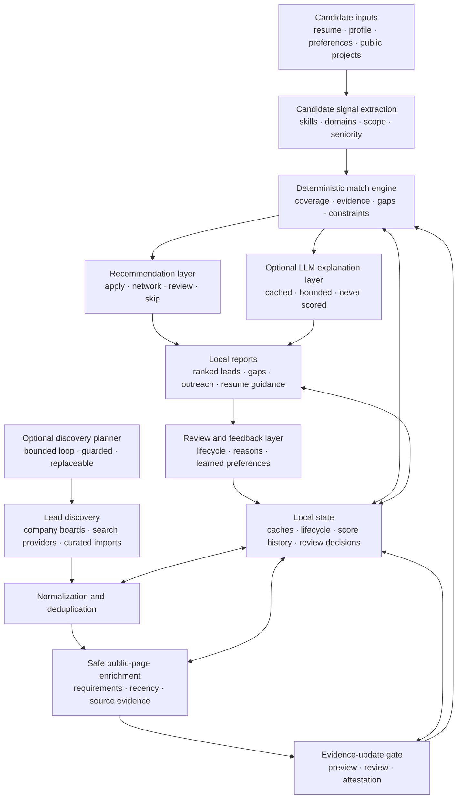

# Pitchr: Public Architecture Overview

**Project status:** Pitchr is a private, proprietary project created by Arathi Seshan. This document describes its architecture and engineering decisions at a portfolio level. The source code, scoring rules, extraction logic, configuration data, and candidate data are not public.

Pitchr is a signal-driven career strategy system that discovers job opportunities, evaluates them against a candidate's documented experience, and produces evidence-backed guidance for prioritization, outreach, and resume tailoring.

Pitchr has a sibling system, **Catchr**, which applies the same deterministic evaluation engine to non-technical roles — Product Management, Customer Success, Operations, and more — specialized through configuration rather than a separate codebase. See [catchr-architecture.md](./catchr-architecture.md).

The project began as a personal workflow tool and evolved into a multi-stage local application designed around four principles:

- Keep sensitive candidate information local.
- Separate deterministic decisions from generative-AI explanations.
- Make every recommendation traceable to evidence.
- Keep repeated searches and analyses reproducible and cost-aware.

## What the system does

Pitchr combines candidate evidence from a resume, professional profile, configured preferences, and selected public project information. It normalizes job leads from several discovery sources, enriches leads from safe public postings, evaluates each role through an explainable match pipeline, and generates a set of local reports.

The reports support:

- Opportunity ranking and triage
- Required-skill coverage and gap analysis
- Direct versus transferable evidence
- Recruiter-facing defensibility review
- Resume-tailoring guidance
- Outreach preparation
- Application lifecycle tracking
- Company research

## High-level architecture

## Architectural boundaries

### 1. Discovery is separate from evaluation

Search providers answer "what opportunities exist?" The match engine answers "how well does this opportunity align with the candidate's evidence?" Keeping these responsibilities separate prevents source-specific behavior from silently changing scoring.

Every lead is normalized into a shared representation before evaluation. The normalization stage handles duplicate links, reposted roles, source metadata, dates, and lifecycle state.

Discovery draws on several independent channels — direct company applicant-tracking boards, paid and free web-search providers, a shared job-index protocol service, public community hiring threads, niche public indexes, and explicitly curated or pasted leads. Each channel is normalized into the same representation, and the report records which channel surfaced a lead so the contribution of each source stays visible.

Discovery also has its own lifecycle. Verified results can propose company boards the configuration does not yet track, and a bounded number of proposals can be inspected during the same run without editing stored configuration. A board is only recommended for removal after repeated observations across a sustained window with no retained strong lead and no application history, and the recommendation shows the evidence behind it. Adding or removing a tracked board is always an explicit, exact, reviewable action.

Several intake rules exist to keep low-quality supply from reaching the scorer at all: a per-employer cap so a board-heavy company cannot flood the set, suppression of aggregators that hide the employer behind unverifiable text, and quarantine of community posts that bundle several openings into one comment rather than scoring them as a single incoherent lead.

### 2. Candidate evidence is extracted independently

Pitchr builds a candidate signal model from configured source documents. Signals include technical skills, platform and domain experience, role scope, seniority, leadership evidence, and target constraints.

The system distinguishes among:

- **Direct evidence:** explicitly supported by the candidate's documents
- **Transferable evidence:** adjacent experience that can credibly bridge a requirement
- **Missing evidence:** a requirement that is neither direct nor safely transferable
- **Context:** information worth reviewing that should not inflate the score

This distinction is preserved in the reports so a high-level percentage never hides how the match was derived.

### 3. The match engine is deterministic

The core ranking path is deterministic and testable. It combines multiple evidence dimensions rather than relying on one keyword-overlap number. Those dimensions include role and level alignment, candidate evidence, requirement coverage, domain relevance, source confidence, recency, gaps, and deal-breakers.

The exact weights, term maps, thresholds, and extraction policies are proprietary. At the architecture level, the important property is that identical normalized inputs produce identical ranking outputs.

### 4. Generative AI is an optional assistance layer

The optional AI layer explains already-computed results and supports bounded drafting tasks such as outreach and résumé guidance. It does not assign or modify match scores, lifecycle state, or pipeline decisions.

This boundary provides several benefits:

- Core evaluation and standard reports can run without generative-model calls.
- Model failures fall back to deterministic output and do not alter ranking results.
- Generated prose can be reviewed independently from its underlying evidence.
- Model selection can change without changing the scoring contract.
- Unchanged generated results can be reused from cache without another model call.

The LLM receives a bounded job excerpt plus the existing match context and returns structured, human-facing fields. If the model is disabled, unavailable, or returns unusable output, deterministic report text remains available.

### 5. Evidence updates pass through an explicit gate

Job pages change. Requirements are edited, postings close, and a re-read of the same page can quietly move a score. Pitchr treats re-extracted evidence as a proposal rather than a fact, and routes it through a staged gate.

- **Preview** recomputes evidence without applying anything. It proves that the retained posting still corresponds to the observed page, then reports the exact field, bucket, authority, lifecycle, and score-component changes an update would cause, including every lead that would newly become closed.
- **Review** is a human step. Applying requires an explicitly selected preview that was actually reviewed.
- **Apply** recomputes each candidate independently and accepts an update only on an exact match against the reviewed manifest of page, posting identity, evidence, authority, lifecycle, and score. A matching in-process attestation must then survive canonical restoration, a later evidence check, and persistence as one complete bundle.
- **Fallback** is canonical. A blocked, drifted, or unverifiable record keeps the evidence it already had rather than accepting a plausible-looking rewrite.

Observations that are exactly neutral — same buckets, same score — may update freshness metadata only, and are counted separately so a freshness refresh is never confused with an evidence change.

Once an accepted extraction is bound to the observed page, the extraction rules in force, the canonical posting identity, and the evidence itself, a later unchanged refresh reuses that evidence directly instead of rebuilding it. Any mismatch drops back to the full guarded path. The diagnostics view reports reuse versus reprocessing, so the cheap path is observable rather than assumed.

The same gate governs automatic refreshes. Ordinary runs refresh evidence when the page cache ages past its threshold, and an explicit full-refresh action only bypasses the cache — it does not bypass the gate. Analysis-only and kill-switch modes exist for the whole mechanism.

### 6. Feedback is captured deterministically before it is interpreted

Declining a lead records a private structured reason and an optional note. After enough compatible examples, the system offers evidence-backed deterministic filter suggestions derived from those reasons alone. Leads the candidate applied to or reviewed positively act as counterevidence, and historical outcomes with no recorded reason are labelled as possible patterns rather than becoming one-click rules.

An optional model pass over the written notes exists as a separate, explicit action. It makes one cached call with minimized context, never runs on panel open, and never sends résumé, profile, full posting text, or lead links. Its findings are labelled by durability, only allowlisted deterministic fields without positive counterexamples can be staged, and no profile change takes effect without an explicit save. Changing the selected model keeps prior findings visible and offers a reanalysis rather than silently paying for a new call.

The pattern is the same one used for explanations: the model proposes, a deterministic gate disposes, and a failure leaves the previous conclusions intact and read-only.

## Agent and model optimization decisions

Pitchr includes several mechanisms intended to control model cost, latency, and failure impact:

- **Task isolation:** model-generated explanations are isolated from ranking and lifecycle logic.
- **Configurable model selection:** the explanation task can use a lower-cost model when appropriate.
- **Stable prompt-prefix caching:** reusable system and candidate context is structured as a stable cached prefix.
- **Persistent result caching:** results are keyed to posting content and model choice, allowing unchanged work to be reused across later runs.
- **Bounded input:** long job descriptions are capped before model submission to avoid sending irrelevant legal and benefits boilerplate.
- **Call ceilings:** a run can limit how many new model calls are allowed.
- **Strategy scoping:** generation can be restricted to selected recommendation groups rather than every discovered lead.
- **Dry-run cost projection:** the system can estimate eligible calls, token volume, and model cost without invoking an API.
- **Actual cost accounting:** a per-run ledger records real model and search-provider spend after the fact, so projections can be checked against what a run actually cost.
- **Graceful fallback:** errors return the workflow to deterministic output instead of failing the overall pipeline.

These controls make the model a replaceable component rather than an unbounded dependency.

### Guarded agentic source planning

Discovery has an optional planning mode in which a model chooses one source at a time rather than following a fixed list. After each refresh the planner reads a privacy-safe snapshot delta and the runtime it cost, then re-plans from that updated evidence. Final ranking attributes selected-lead yield back to newly introduced sources so later decisions inherit real outcomes rather than guesses.

The interesting part is not the loop; it is the enforcement. Guards live in code, not in the prompt. They block repeated sources, any source already refreshed successfully that day, provider-specific quota overruns, more than a small number of source attempts, and more than an hour of total discovery time. Manual and direct refreshes are recorded through the same observation boundary, failed refreshes stay retryable, and free-allowance requests are metered as allowance rather than described as spend.

Extraction, scoring, and ranking are untouched by the planner. If it fails, the run falls back to the next safe source from the static list. An agent is allowed to decide *where to look*; it is not allowed to decide *what a match is worth*.

## Evidence provenance and explainability

A job requirement may come from an explicitly curated lead, a public posting section, or another supported source. Candidate evidence may come from the resume, professional profile, public projects, or a configured transferable-skill relationship.

Pitchr carries this provenance into its review surfaces. A user can see whether a match is direct, adjacent, preferred rather than required, or still unsupported. Gap displays include the posting evidence that caused the term to be treated as a requirement.

Provenance is derived when a report is rendered rather than frozen into stored state, so it cannot drift away from the evidence it claims to describe. When a term's supporting text no longer survives, the report says so instead of guessing. Supporting quotes are selected by a ranked search over the posting's sections rather than by first occurrence, because on scraped pages the earliest mention of a skill is usually navigation furniture rather than a real requirement — and the quote and its section label always come from the same occurrence.

This approach is designed to reduce two common failure modes:

1. Crediting experience the candidate does not actually have.
2. Penalizing the candidate for prose, navigation text, benefits language, or optional qualifications incorrectly treated as requirements.

## Candidate-facing generated artifacts

Beyond ranking, Pitchr produces drafting artifacts for the roles worth pursuing: reframed résumé bullets, tailored summary paragraphs, outreach cover letters, and an optional tailored word-processor document per selected lead.

These follow the same containment rules as every other model feature. They are opt-in, cost-capped, cached per posting, and report-only. A posting is treated as context about the team's work, never as evidence about the candidate: a rewrite cannot introduce a number, employer, or claim the underlying draft does not already make, and a rewrite that only shortens the draft is discarded in favor of the deterministic template. Leads in terminal states are never tailored, and anything already paid for reappears on later runs at no cost rather than silently disappearing.

Saved artifacts belong to a posting, not to a company and title. When two distinct requisitions at the same employer share a title, Pitchr does not guess which one owns a saved document. It surfaces the candidates with their exact links and asks. The choice is validated against a freshly recomputed ambiguity group on submission, refused while a run is in progress, rolled back if its audit record cannot be written, and archives rather than deletes the original file.

## Local application and observability

Pitchr runs as a local desktop application over the same deterministic pipeline used by scheduled and command-line workflows. The interface provides guided run configuration, local reports, lifecycle management, reviewed vocabulary decisions, and explicitly selected résumé-tailoring actions without moving candidate data to a hosted Pitchr service.

A first-run flow bootstraps a usable profile from a résumé plus a target role and location, deriving suggested levels, domains, and technical evidence locally. Provider credentials are stored in the operating system keychain rather than in project files. Packaged upgrades refresh application and engine assets while leaving candidate documents, working leads, and generated state untouched in a private per-user directory.

The application boundary is deliberately narrow. The local service listens only on the loopback interface, validates the request host, requires a per-launch token for every mutating request, and accepts structured fields rather than command lines — no arbitrary commands, arguments, environment variables, or filesystem paths. The only process the interface can start is the ordinary pipeline wrapper.

Writes are just as bounded. The pipeline remains the sole owner of generated reports and bulk lead preparation. Dedicated endpoints may update only their own fixed state: lifecycle choices, review and feedback state, profile settings, and the reviewed vocabulary lists. Vocabulary saves accept term lists rather than paths or file bodies, are additive, are serialized against each other, back up the current lists, and atomically restore prior content if a multi-file write fails. Saving never starts a pipeline run and never rewrites lead evidence.

A private diagnostics view turns historical run data into visual trends: runtime by phase, lead-stage movement, score trajectories with named per-lead drill-downs, extraction freshness and its blockers, evidence-gate decisions, and per-source discovery contribution and conversion. A verified-growth panel traces the funnel from search results to selected leads, separating genuine losses from links that resolved to another destination, and reconciles every observation so duplicates cannot masquerade as growth. A score-protection summary reports only aggregate counts of prevented unexplained changes and accepted verified updates; the per-event audit stays in private local data. Score-change counts exclude leads that have aged out while retaining applied and active ones, and a data-integrity signal still flags lifecycle-coupled evidence changes so reopening a lead is safe.

Diagnostics is off by default, is never added to shareable reports, and embeds aggregate counts, labels, and digests rather than résumé, profile, or posting text. An optional local alert preview highlights changes that may deserve attention; it has no delivery integration and sends nothing externally.

Application controls remain separate from ranking and extraction logic. The interface starts approved pipeline workflows, while the pipeline remains responsible for evaluation and generated state.

## Reliability and reproducibility

Pitchr treats ranking changes as changes that should be observable, not hidden.

Reliability mechanisms include:

- Persistent public-page caches with controlled refresh behavior and separate freshness policies for evidence and closure checks
- Idempotent normalization and deduplication, with posting identity precise enough that two requisitions sharing a careers path are never reported as one lead moving
- Durable lifecycle state for applied, rejected, closed, and preserved leads
- Score-history snapshots and score-delta reports, with privacy-safe digests marking which input category changed
- Versioned extraction behavior for detecting stale derived data, plus reconciliation reporting on what became current, what stayed stale, and why
- Safe fallbacks for unavailable network and model services
- Structural validation of generated Markdown and HTML reports
- More than 1,300 automated tests across eleven suites, covering parsing, matching, evidence handling, the evidence gate, caching, rendering, lifecycle behavior, diagnostics, scheduling, source planning, application workflows, and failure cases

The system favors precision over aggressive inference. Unknown terms are surfaced for review instead of automatically becoming scored requirements.

Score-bearing changes carry their own review discipline. A change to scoring, extraction, identity, evidence authority, persistence, or lifecycle movement is validated against frozen before-and-after records for the same posting: if behavior is not meant to change, the expected score delta is exactly zero, and if it is meant to change, every allowed movement must have a named cause and everything else fails the check.

## Privacy and security model

Pitchr is local-first. Sensitive inputs, generated reports, caches, API credentials, and application state are excluded from the public repository surface.

Additional safeguards include:

- Privacy-mode rendering that redacts local paths and candidate identifiers
- Separation of private inputs, user-maintained workspace state, and generated artifacts
- Restricted enrichment of public job pages
- Credential storage in the operating system keychain rather than project files
- Private per-user state stored with owner-only directory and file permissions
- Loopback-only service binding with host validation and per-launch request tokens
- Diagnostics and audit records that store labels, counts, and digests instead of source text
- No requirement to upload resume or profile data to a hosted Pitchr service
- Explicit opt-in for paid model generation

## Engineering trade-offs

### Deterministic ranking versus model-based ranking

Using a deterministic match engine requires maintaining vocabularies, evidence rules, and extraction policies. It is less flexible than asking a model for a single fit score, but it provides reproducibility, inspectability, offline operation, and clearer regression testing.

### Precision versus recall

Pitchr intentionally avoids promoting every unfamiliar phrase into a skill. This can miss emerging terminology until it is reviewed, but it substantially reduces false gaps and inflated scores caused by arbitrary prose.

### Guarded automation versus frictionless automation

The evidence gate and the reviewed-vocabulary flow both insert a human step into work a machine could complete unattended. That costs convenience on every routine refresh. It buys the property that matters more here: a score cannot move without a visible, attributable cause.

### Local-first versus hosted collaboration

Local operation protects candidate data and keeps the workflow inexpensive. The trade-off is that synchronization and multi-user collaboration are not first-class capabilities.

### Single-system simplicity versus service decomposition

The current implementation favors a compact local architecture with explicit stage boundaries. Those boundaries would support later service decomposition, but the personal-use product does not require distributed deployment complexity.

## What I learned

Building Pitchr reinforced several engineering lessons:

- AI-generated explanations are safer when they cannot mutate the decision path.
- An agent can be trusted to choose where to look once the limits on that choice live in code rather than in the prompt.
- Provenance is as important as the final recommendation, and is safer derived than stored.
- Caching needs semantic invalidation rules, not just timestamps.
- A scoring change is incomplete without score-delta analysis across a realistic corpus.
- Required, preferred, transferable, contextual, and missing evidence must remain distinct throughout the pipeline.
- Re-reading the same source is a write, and deserves the same review a write gets.
- Cost and reliability controls should be designed before a model feature is enabled by default.

## Project status and ownership

Pitchr is an actively developed private project by **Arathi Seshan**. This page is a portfolio architecture overview, not source-code documentation or an open-source release.

- GitHub: [arathivanchi-max](https://github.com/arathivanchi-max)
- LinkedIn: [Arathi Seshan](https://www.linkedin.com/in/arathi3)

Copyright © 2026 Arathi Seshan. All rights reserved. No license to the private implementation, scoring system, extraction policies, or proprietary documentation is granted by this overview.
